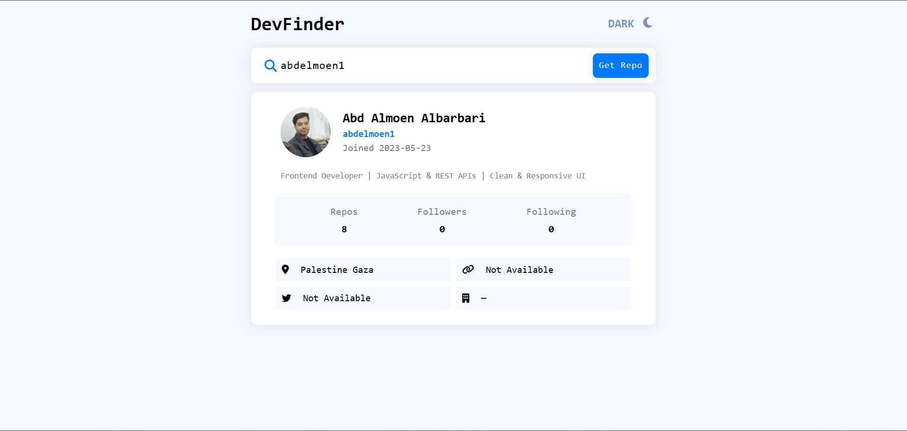
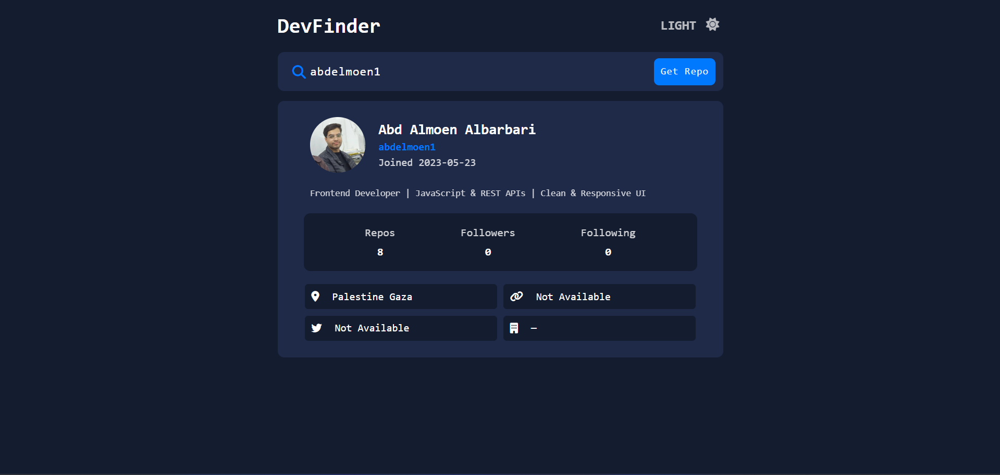

## GitHub User Search

A modern and responsive web application that fetches and displays GitHub user data using the GitHub REST API.

This project demonstrates API integration, dynamic DOM rendering, theme persistence using LocalStorage, and structured UI state management using Vanilla JavaScript.

---

## 📌 Overview

GitHub User Search allows users to search for any public GitHub profile and view essential information such as repositories, followers, bio, and social links.

The application is built entirely with HTML, CSS, and Vanilla JavaScript without any frameworks, focusing on clean architecture, DOM manipulation, and asynchronous API handling.

---

## 🚀 Features

#### 🔍 Search for any public GitHub user

#### 📡 Fetch data from the GitHub REST API

#### ⏳ Custom loading animation while fetching data

#### ❌ Error handling for:

- 404 (User not found)

- Network errors

#### 📊 Display:

 - Public repositories

 - Followers

 - Following

#### 🔗 External links:

 - Blog

 - Twitter

#### 🎨 Light / Dark mode toggle

#### 💾 Theme persistence using LocalStorage

#### 📱 Fully responsive design (Flexbox & CSS Grid)

---

## 🛠️ Technologies Used

- HTML5

- CSS3

- Flexbox

- CSS Grid

- Vanilla JavaScript (ES6+)

- Fetch API

- LocalStorage API

- GitHub REST API

---

## 🧠 What This Project Demonstrates

This project highlights:

- Working with third-party REST APIs

- Handling asynchronous operations using async/await

- Dynamic DOM creation and structured UI rendering

- UI state management (Loading / Success / Error states)

- Conditional rendering based on API data

- Persistent theme storage using LocalStorage

- Responsive UI design without external libraries

---

## 📂 Project Structure

github-user-search/
│
├── index.html                  
│
├── CSS/                        
│   ├── style.css               
│   ├── normalize.css           
│   └── all.min.css             
│
├── JS/                         
│   └── main.js                 
│
└── README.md                   

---

## 🔌 API Reference

Data is fetched from:

https://api.github.com/users/{username}

Official documentation:
https://docs.github.com/en/rest

---

## 📷 Screenshots

---

## 🌍 Live Demo

🚀 **Live Application:**  
[Open Live Demo](https://github-serch.netlify.app/)

---

## ⚙️ How to Run Locally

Clone the repository:

git clone https://github.com/your-username/github-user-search.git

Open index.html in your browser.

No build tools or dependencies required.

---

## 📈 Future Improvements

- Add repository list preview

- Add pagination support

- Add search history

- Improve accessibility (ARIA roles)

- Add unit testing

---

## 👤 Author

Abd Almoen Albarbari

Frontend Developer

